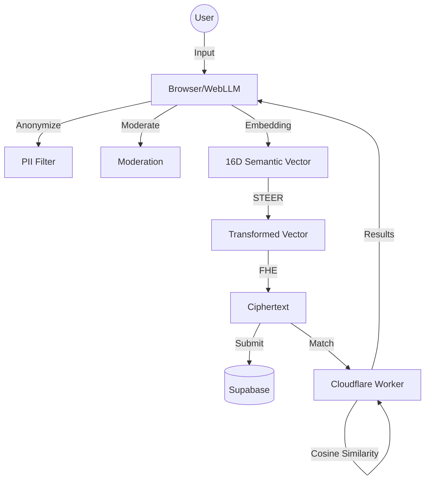

# Echo: Secure Resonance Engine

Echo is a privacy-first social discovery platform that pairs users based on the mathematical similarity of their unperformed thoughts. Using browser-native AI and homomorphic encryption, Echo ensures that your internal world remains private while finding deep resonance with others.

## Tech Stack
| Layer | Technologies |
|---:|---|
| **Frontend** | React 18, Vite, Tailwind CSS, Motion/React |
| **Identity** | Didit Biometric SDK (Mock) |
| **On-Device AI** | WebLLM (Llama-3.2), Semantic Embeddings (16D) |
| **Privacy** | STEER Transformation, Homomorphic Encryption (FHE) |
| **Backend** | Supabase (Posts, Auth, Profiles) |
| **Edge Compute** | Cloudflare Pages Functions (Signal Matching) |

## Architecture


## Environment Variables
Ensure the following are set in your `.env` (local) and Cloudflare/Supabase dashboards (production):
- `VITE_SUPABASE_URL`: Your Supabase Project URL
- `VITE_SUPABASE_ANON_KEY`: Your Supabase Anon Key
- `VITE_DIDIT_CLIENT_ID`: Didit Application Client ID
- `SUPABASE_SERVICE_KEY`: Service role key (Cloudflare Worker only)

## Local Setup
1. **Clone & Install**:
   ```bash
   git clone <repo-url>
   npm install
   ```
2. **Configure**: Create a `.env` file with the keys above.
3. **Run**:
   ```bash
   npm run dev
   ```

## Deployment
1. Push the repository to GitHub.
2. Connect the repository to **Cloudflare Pages**.
3. **Build settings**:
   - Framework preset: `Vite`
   - Build command: `npm run build`
   - Build output directory: `dist`
4. Add environment variables in the Cloudflare dashboard.
5. Deploy.
